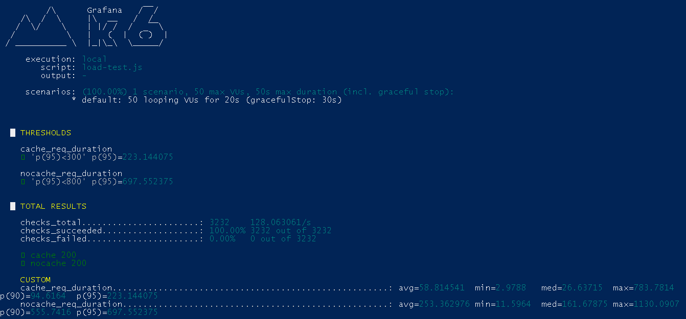

# PlatinumCoin Cache
**Microserviço de Pedidos com MySQL e Redis usando Clean Architecture + Load Testing**

---

## 📖 Visão Geral

O **PlatinumCoin Cache** é um microserviço desenvolvido para gerenciar pedidos de maneira eficiente, combinando:

- Um modelo de **Clean Architecture** que separa claramente Domínio, Casos de Uso, Gateway, Infraestrutura e Interface.
- **MySQL** como banco de dados relacional, para persistência confiável.
- **Redis** para cache de leituras frequentes e controle de **idempotência** via cabeçalho `X-Idempotency-Key`, evitando duplicidade de processamento.
- **Bean Validation** no Domínio, com exceções estruturadas (`DomainException` e `ErrorDetail`) para relatórios de erros detalhados.
- **Docker Compose** disponível para subida da infra.
- **Collection** disponível para testes locais.
- **Load test** disponível load-test.js para testes utilizando K6.
---

## 🧪 Load Testing

Para validar o ganho de desempenho trazido pelo cache, criamos um teste comparativo usando o [k6](https://k6.io/), simulando **50 usuários simultâneos** (VUs) por **20 segundos**. Antes da carga, um endpoint dedicado gera **100 pedidos** de teste; em seguida, o script `load-test.js` faz duas chamadas por iteração:

1. **COM CACHE** (`GET /orders/{id}`)
2. **SEM CACHE** (`GET /orders/no-cache/{id}`)

### 📊 Principais resultados

- **COM CACHE**
    - média (avg): 58 ms
    - percentil 95 (p95): 223 ms

- **SEM CACHE**
    - média (avg): 253 ms
    - percentil 95 (p95): 697 ms


---

> **Passos para reproduzir**
> 1. Suba os serviços com `docker-compose up -d`
> 2. Suba a aplicação local
> 3. Execute o script de carga dentro da pasta `k6-loadtest`:
>    ```bash
>    k6 run load-test.js --summary-trend-stats="avg,min,med,max,p(90),p(95)"
>    ```  
> 4. Confira as diferenças entre `cache_req_duration` e `nocache_req_duration`.


## 🚀 Tecnologias Principais

- **Java 21**
- **Spring Boot 3.4.5**
- **Spring Data JPA**
- **Spring Data Redis (Lettuce)**
- **MySQL 8.0**
- **Redis 7.0**
- **Lombok**
- **Maven**
- **K6**

---